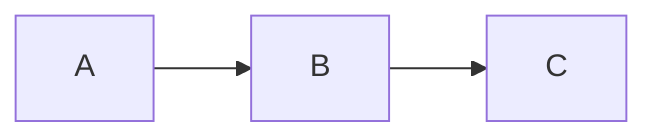

# MARKDOWN CHEATSHEET

---

## Table of Contents

1. [Front Matter / Metadata](#front-matter--metadata)  
2. [Basic Structure](#basic-structure)  
3. [Headings](#headings)  
4. [Emphasis & Typography](#emphasis--typography)  
5. [Lists](#lists)  
   1. [Unordered Lists](#unordered-lists)  
   2. [Ordered Lists](#ordered-lists)  
   3. [Definition Lists](#definition-lists)  
6. [Code](#code)  
7. [Blockquotes](#blockquotes)  
8. [Links & Images](#links--images)  
9. [Tables](#tables)  
10. [Footnotes](#footnotes)  
11. [Task Lists](#task-lists)  
12. [Comments](#comments)  
13. [Custom Attributes & Containers](#custom-attributes--containers)  
14. [Math & Diagrams](#math--diagrams)  
15. [Citations & Bibliography](#citations--bibliography)  
16. [Table of Contents Marker](#table-of-contents-marker)  
17. [Dropdowns](#dropdowns)  
18. [Raw HTML Embedding](#raw-html-embedding)  

---

## Front Matter / Metadata

**Markdown**  
```yaml
---
title: "Document Title"
author: Your Name
date: 2025-04-28
tags:
  - markdown
  - reference
---
```

**Rendered Output**  
_(YAML front matter is consumed by your site generator and not shown in HTML.)_

---

## Basic Structure

**Markdown**  
```markdown
Paragraph one.

Paragraph two.

Line  
break (two spaces + return)

Soft  
wrap (just a single return; merges into a single paragraph)
```

**Rendered Output**

Paragraph one.

Paragraph two.

Line  
break (two spaces + return)

Soft wrap (just a single return; merges into a single paragraph)

---

## Headings

**Markdown**  
```markdown
# H1
## H2
### H3
#### H4
##### H5
###### H6
```

**Rendered Output**  

# H1  
## H2  
### H3  
#### H4  
##### H5  
###### H6  

---

## Emphasis & Typography

**Markdown**  
```markdown
*italic*    _italic_  
**bold**    __bold__  
***bold and italic***  
~~strikethrough~~           <!-- GitHub -->
==highlight==               <!-- Markdown Extra / Pandoc -->
```

**Rendered Output**

*italic* _italic_  
**bold** __bold__  
***bold and italic***  
~~strikethrough~~  
==highlight==  

---

## Lists

### Unordered Lists

**Markdown**  
```markdown
- Item A
- Item B
  - Nested B1
  - Nested B2
* Another item
+ Yet another
```

**Rendered Output**

- Item A  
- Item B  
  - Nested B1  
  - Nested B2  
- Another item  
- Yet another  

### Ordered Lists

**Markdown**  
```markdown
1. First
2. Second
   1. Sub-second A
   2. Sub-second B
3. Third
```

**Rendered Output**

1. First  
2. Second  
   1. Sub-second A  
   2. Sub-second B  
3. Third  

### Definition Lists

*(Markdown Extra / Pandoc)*

**Markdown**  
```markdown
Term 1
: Definition of term 1

Term 2
: Definition 2a
: Definition 2b
```

**Rendered Output**

Term 1  
: Definition of term 1  

Term 2  
: Definition 2a  
: Definition 2b  

---

## Code

### Inline Code

**Markdown**  
```markdown
Use the `printf()` function.
```

**Rendered Output**

Use the `printf()` function.

### Fenced Code Blocks

**Markdown**  
<pre markdown="1">
```python
def greet(name):
    print(f"Hello, {name}!")
```
</pre>

**Rendered Output**

```python
def greet(name):
    print(f"Hello, {name}!")
```

### Indented Code Blocks

**Markdown**  
```
    This is an indented code block.
    Four spaces at the start of each line.
```

**Rendered Output**

    This is an indented code block.
    Four spaces at the start of each line.

---

## Blockquotes

**Markdown**  
```markdown
> This is a blockquote.
> It can span multiple lines.

> > Nested blockquote
```

**Rendered Output**

> This is a blockquote.  
> It can span multiple lines.  
>
> > Nested blockquote  

---

## Links & Images

### Links

**Markdown**  
```markdown
[Example Site](https://example.com "Title text")  
<https://example.com>  <!-- Autolink -->
```

**Rendered Output**

[Example Site](https://example.com "Title text")  
<https://example.com>  

### Images

**Markdown**  
```markdown

```

**Rendered Output**

  

---

## Tables

**Markdown**  
```markdown
| Left   | Center  | Right   |
|:-------|:-------:|--------:|
| L1     |   C1    |      R1 |
| **L2** |   C2    |    R2   |
```

**Rendered Output**

| Left   | Center  | Right   |
|:-------|:-------:|--------:|
| L1     |   C1    |      R1 |
| **L2** |   C2    |    R2   |

---

## Footnotes

**Markdown**  
```markdown
Here is a statement with a footnote.[^1]

[^1]: This is the footnote text.
```

**Rendered Output**

Here is a statement with a footnote.[^1]

[^1]: This is the footnote text.

---

## Task Lists

*(GitHub)*

**Markdown**  
```markdown
- [ ] To do item
- [x] Completed item
```

**Rendered Output**

- [ ] To do item  
- [x] Completed item  

---

## Comments

**Markdown**  
```html
<!-- This comment will not be rendered -->
```

**Rendered Output**

*(No visible output)*

---

## Custom Attributes & Containers

### Attributes (Pandoc)

**Markdown**  
```markdown
Here’s a paragraph marked {#para1 .highlight}.

```c++ {#code-block .numberLines}
int main() { return 0; }
```
```

**Rendered Output**

Here’s a paragraph marked {#para1 .highlight}.

```c++ {#code-block .numberLines}
int main() { return 0; }
```

### Admonitions / Containers

*(Markdown Extra / Pandoc / MkDocs plugins)*

**Markdown**  
```markdown
::: note
This is a note block.
:::

::: warning
This is a warning block.
:::
```

**Rendered Output**

::: note
This is a note block.
:::

::: warning
This is a warning block.
:::

---

## Math & Diagrams

### Math (Pandoc/LaTeX)

**Markdown**  
```markdown
Inline math: $a^2 + b^2 = c^2$.

Block math:
$$
E = mc^2
$$
```

**Rendered Output**

Inline math: $a^2 + b^2 = c^2$.

Block math:
$$
E = mc^2
$$

### Mermaid Diagrams

**Markdown**  
<pre markdown="1">

</pre>

**Rendered Output**


---

## Citations & Bibliography

*(Pandoc)*

**Markdown**  
```markdown
According to Doe [@doe2020], …

---
bibliography: references.bib
---
```

**Rendered Output**

According to Doe [@doe2020], …

---

## Table of Contents Marker

**Markdown**  
```markdown
[TOC]
```

**Rendered Output**

[TOC]  

---

## Dropdowns

Use HTML’s `<details>` element to create collapsible sections. Below is an example wrapping your Day 1 setup instructions (from `day1.md`) in a dropdown  ([ai-django-react/day1.md at main · cache-hadoop30/ai-django-react · GitHub](https://github.com/cache-hadoop30/ai-django-react/blob/main/day1.md)).

**Markdown**  
````markdown
<details>
  <summary>Day 1: Setup & Basic Django Project</summary>

  ### Pre-requisite
  1. Create a project directory (ex. django-react-fullstack)
  2. Open the folder in Visual Studio Code
  3. Open the terminal

  ### 1. Set Up the Django Environment
  ```bash
  pip install virtualenv
  python -m venv venv
  source venv/bin/activate
  ```
</details>
````

**Rendered Output**

<details>
  <summary>Day 1: Setup & Basic Django Project</summary>

  ### Pre-requisite
  1. Create a project directory (ex. django-react-fullstack)
  2. Open the folder in Visual Studio Code
  3. Open the terminal

  ### 1. Set Up the Django Environment
  ```bash
  pip install virtualenv
  python -m venv venv
  source venv/bin/activate
  ```
</details>

---

## Raw HTML Embedding

**Markdown**  
```html
<video controls>
  <source src="movie.mp4" type="video/mp4">
  Your browser does not support the video tag.
</video>
```

**Rendered Output**

<video controls style="max-width:200px">
  <source src="movie.mp4" type="video/mp4">
  Your browser does not support the video tag.
</video>

---

Keep this complete reference on hand—and adapt any section to fit the Markdown flavor or renderer you’re using.
